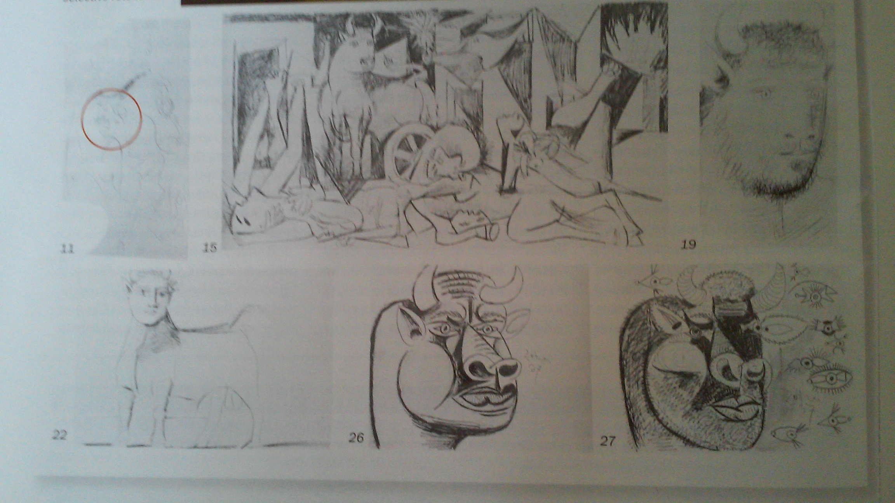
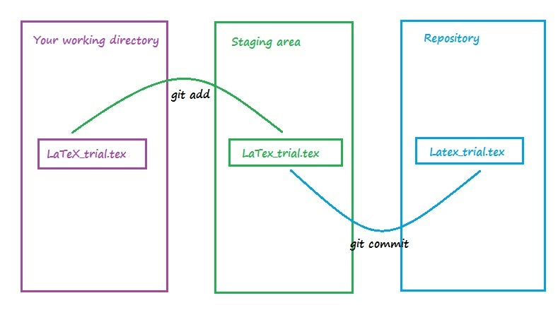
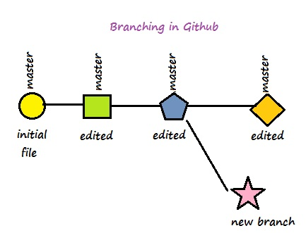
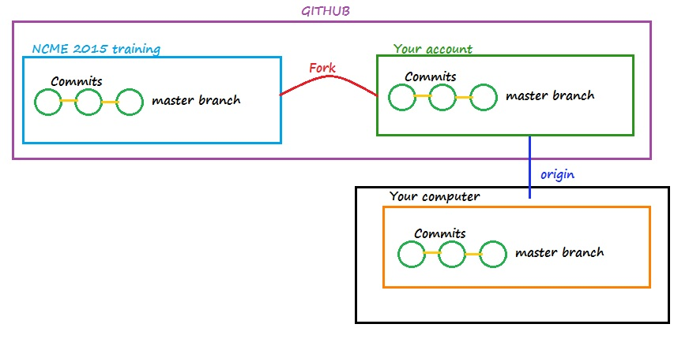

## My inspration to use Github is Picasso
### Do you recognize this famous painting?

    

---

## The steps that I will follow today

> 1. What is LaTeX?
> 2. Github Example  
  - Put your LaTeX document into your Github repository 
  - Branching,merging and dealing with conflicts 
> 3. Git to collaborate with others 
  - Fork a remote repository (this is on server side)
  - Clone remote repo into your local  
  - Make the changes in your local and remote repo 
  - Sycncing a fork
    - Get the changes from remote repo Fetch vs. Pull
  - Git fetch upstream 
  - Submit pull request to project owner 

---

## Are we ready to start? 

    

---

## LaTeX 
>1. What is LateX? 
>2. Steps to create a simple document:
  - Open the text editor
  - Save a blank file (name it as "latex_(your_initials)_trial.tex")

---    

## Step-by-step LaTeX example 

>1. Remember that you need backslash ("\") for each command in LateX
  - \documentclass[11pt]{article}
  - \begin {document}
  - \section {Welcome}
  - \textit(Hello) \underline{from} \textbf{NCME}
  - Happy to see you all. Let's start with some math.  Given that $(z+1)$ and $(z+4)$,         
  - The area is presented by $Area=z^2+5z+4$ 
  - \subsection[10]{context} We will cover good things!!!
  - \end{document}
  
>2. Create another LateX document

---

## Github: Put your document into your repository   

>1. Open your command line (assuming your file is under Directory1)
  - cd Directory1 (change your working directory) 
  - git init      (Create or restart an existing repo)
  - git add <file name> (add files into staging area )
  - git commit -m "your message here"

>2. Git simple structure

    

---

## Github: Make and track edits

>1. Add a sentence into your LaTeX file 
 - Check your git status
 - Check the differences 
 - Commit your changes 
 - Push into your repository 

---

## Maintaining Multiple branches for a project

    

>1. Create a new branch 
>2. Add a formula into your document for your new purpose
  - P_{ij}=\frac{\text{exp}(\theta_j-b_i)}{1+\text{exp}(\theta_j-b_i)}.
>3. Go back to your master branch and delete the last sentence you added.
>4. Add a new sentence
>5. Merge two branches 

---

## Github for collaboration
### Let's help me to finish my dissertation :)

>1. Fork the repo (need to do this online)
  - [NCME 2015 training website](https://github.com/CenterForAssessment/NCME_Training_Session_2015/)
  - In the top-right corner of the page, click Fork.
  - Chek your own github repo
>2. Clone your fork of repository 
  - git@github.com:ruhancirci/NCME_Training_Session_2015.git  
   (add "<space> NCME2015_workshop" if you want to extract into a specific folder)
  - Simple forking structure 

   
    

---

## Github for collaboration
### Make some edits into a chapter you select

>1. Check git status in your local repo
>2. Make edits into a file and save
>3. Commit your edits 
>4. Push your edits into your remote repo

----

## Github for collaboration
### Syncing a fork (via git fetch)

>1. Go to your remote fork repository and make some in a file
>2. Check your git status
>3. Run the command git fetch
>4. Check the difference between remote and local master 

---

## Github for collaboration
###  Pull request
>1. git remote add upstream [NCME 2015 training https](https://github.com/CenterForAssessment/NCME_Training_Session_2015.git)
>2. We can use git fetch upstream to get the updates from upstream repo
>3. Go to your own repo and click "Pull requests" 

---

## Thank You

Contact: ruhan.circi@colorado.edu

---

   
